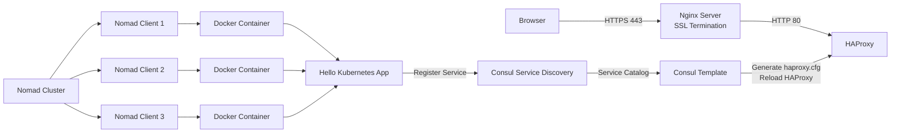

# Nomad + Consul + HAProxy + Nginx SSL Reverse Proxy Setup

## Project Overview

This project demonstrates a complete application deployment stack using HashiCorp Nomad, Consul, Consul Template, HAProxy, Docker, and Nginx with HTTPS termination.

The objective is to deploy a containerized application on a Nomad cluster, register services in Consul, dynamically generate HAProxy backends using Consul Template, and securely expose the application through Nginx using SSL/TLS.

---

# End-to-End Traffic Flow



## Dynamic Configuration Flow

```text
Nomad Deployment
        ↓
Service Registration in Consul
        ↓
Consul Template Detects Change
        ↓
Generate haproxy.cfg
        ↓
Reload HAProxy
        ↓
Traffic Routed to New Service
```

# Components Used

- Ubuntu 24.04 LTS
- Docker
- HashiCorp Nomad
- HashiCorp Consul
- Consul Template
- HAProxy
- Nginx
- OpenSSL
- Self-Signed SSL Certificate

# Step 1: Install Docker

```bash
sudo apt update
sudo apt install docker.io -y
sudo systemctl enable docker
sudo systemctl start docker
docker ps
```

# Step 2: Install and Configure Consul

```bash
wget https://releases.hashicorp.com/consul/<VERSION>/consul_<VERSION>_linux_amd64.zip
sudo unzip consul*.zip -d /usr/local/bin/
consul version
```

Example config:

```hcl
datacenter = "dc1"
data_dir = "/opt/consul"
server = true
bootstrap_expect = 3

ui_config {
  enabled = true
}
```

ACL:

```hcl
acl {
  enabled = true
  default_policy = "deny"
  enable_token_persistence = true
}
```

Bootstrap:

```bash
consul acl bootstrap
export CONSUL_HTTP_TOKEN=<SECRET_ID>
```

# Step 3: Install and Configure Nomad

```bash
wget https://releases.hashicorp.com/nomad/<VERSION>/nomad_<VERSION>_linux_amd64.zip
sudo unzip nomad*.zip -d /usr/local/bin/
```

```hcl
server {
  enabled = true
  bootstrap_expect = 3
}

client {
  enabled = true
}
```

ACL:

```hcl
acl {
  enabled = true
}
```

Bootstrap:

```bash
nomad acl bootstrap
export NOMAD_TOKEN=<SECRET_ID>
```

# Step 4: Deploy Sample Application

Use your webapp.nomad job file with service registration:

```hcl
service {
  name = "sample-app"
  port = "http"
}
```

Deploy:

```bash
nomad job run webapp.nomad
```

# Step 5: Install Consul Template

```bash
wget https://releases.hashicorp.com/consul-template/<VERSION>/consul-template_<VERSION>_linux_amd64.zip
unzip consul-template*.zip
sudo mv consul-template /usr/local/bin/
```

Template example:

```hcl
backend sample-app_backend
    balance roundrobin

    {{ range service "sample-app" }}
    server {{ .Node }}-{{ .ID }} {{ .Address }}:{{ .Port }} check
    {{ end }}
```

Config:

```hcl
consul {
  address = "127.0.0.1:8500"
}

template {
  source      = "/etc/consul-template/templates/haproxy.ctmpl"
  destination = "/etc/haproxy/haproxy.cfg"

  command = "systemctl reload haproxy"
}
```

# Step 6: Configure HAProxy

Example:

```haproxy
global
    daemon
    maxconn 256

defaults
    mode http
    timeout connect 5s
    timeout client 30s
    timeout server 30s

frontend http_front
    bind *:80

    acl is_sample_app path_beg /lander
    use_backend sample-app_backend if is_sample_app

    default_backend sample-app_backend

backend sample-app_backend
    balance roundrobin

    {{ range service "sample-app" }}
    server {{ .Node }}-{{ .ID }} {{ .Address }}:{{ .Port }} check
    {{ end }}
```

# Step 7: Configure Nginx SSL Reverse Proxy

Generate self-signed certificate:

```bash
sudo openssl req -x509 -nodes -days 365 \
-newkey rsa:2048 \
-keyout /etc/ssl/private/sampleapplication.key \
-out /etc/ssl/certs/sampleapplication.crt
```

Nginx:

```nginx
server {
    listen 80;
    server_name sampleapplication.com;
    return 301 https://$host$request_uri;
}

server {
    listen 443 ssl;

    ssl_certificate /etc/ssl/certs/sampleapplication.crt;
    ssl_certificate_key /etc/ssl/private/sampleapplication.key;

    location / {
        proxy_pass http://<HAPROXY-IP>:80;
    }
}
```

# Local Hosts Entry

```text
65.0.110.181 sampleapplication.com
```

# Validation

```bash
curl -k https://sampleapplication.com
sudo ss -tulpn | grep 443
nomad status
consul members
```

# Final Result

- Nomad schedules workloads
- Consul registers services
- Consul Template generates HAProxy configuration
- HAProxy load balances requests
- Nginx terminates SSL
- Application served over HTTPS

# Future Enhancements

- Let's Encrypt
- Route53
- Vault
- Prometheus
- Grafana
- Jenkins CI/CD
- Blue/Green Deployments
- Multi-region HA
