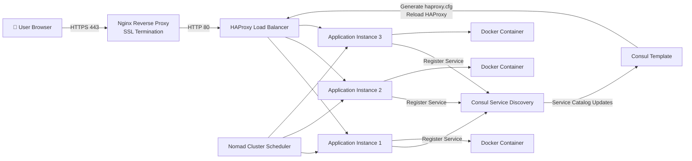

# Nomad + Consul + HAProxy + Nginx Project Overview

## Overview

This repository documents the complete setup and implementation of a highly available application deployment platform using HashiCorp Nomad, Consul, Consul Template, HAProxy, Nginx, Docker, and AWS EC2.

The project demonstrates how applications can be deployed, discovered, load-balanced, and securely exposed using modern infrastructure and service discovery tools.

---

## Project Objective

The primary goal of this project is to:

* Build a 3-node Nomad cluster
* Implement service discovery using Consul
* Enable dynamic HAProxy backend generation using Consul Template
* Deploy containerized applications using Docker
* Configure load balancing through HAProxy
* Secure application traffic using Nginx and SSL/TLS
* Simulate a production-style infrastructure environment

---

## Architecture

---

## Key Technologies

| Technology      | Purpose                          |
| --------------- | -------------------------------- |
| AWS EC2         | Infrastructure Hosting           |
| Docker          | Container Runtime                |
| Nomad           | Workload Scheduling              |
| Consul          | Service Discovery                |
| Consul Template | Dynamic Configuration Generation |
| HAProxy         | Load Balancing                   |
| Nginx           | Reverse Proxy & SSL Termination  |
| OpenSSL         | Certificate Generation           |

---

## Project Highlights

### Nomad Cluster

A 3-node Nomad cluster was configured to provide workload scheduling and high availability.

### Service Discovery

Consul was integrated with Nomad to automatically register application services.

### Dynamic HAProxy Configuration

Consul Template continuously watches the Consul catalog and automatically updates HAProxy whenever services are added, removed, or rescheduled.

### Application Deployment

A sample Docker-based application was deployed using Nomad jobs and exposed through the load balancing layer.

### Secure Access

Nginx was configured as a reverse proxy with SSL/TLS termination, allowing applications to be accessed securely over HTTPS.

---

## Repository Structure

| File                 | Description                              |
| -------------------- | ---------------------------------------- |
| Final.md             | Complete end-to-end implementation guide |
| fulldoc.md           | Detailed project documentation           |
| nomad-3cluster.md    | Nomad cluster setup and configuration    |
| nomad with consul.md | Nomad and Consul integration             |
| commands.md          | Frequently used commands                 |
| debugging.md         | Troubleshooting and debugging steps      |

---

## Learning Outcomes

Through this project, the following concepts were implemented and validated:

* Infrastructure provisioning
* Cluster formation and quorum concepts
* Service discovery
* Dynamic configuration management
* Load balancing
* Reverse proxy configuration
* SSL/TLS implementation
* Docker container orchestration
* High availability architecture
* DevOps troubleshooting practices

---

## Future Improvements

* Let's Encrypt SSL Certificates
* AWS Route53 DNS Integration
* Vault Integration
* Prometheus Monitoring
* Grafana Dashboards
* CI/CD Pipeline using Jenkins
* Blue-Green Deployments
* Auto Scaling
* Multi-Region Deployment

---

## Conclusion

This project successfully demonstrates a production-inspired deployment architecture where Nomad schedules workloads, Consul manages service discovery, Consul Template automates HAProxy configuration, and Nginx securely exposes applications over HTTPS.

The repository serves as both a learning resource and a practical reference for DevOps, Platform Engineering, and Site Reliability Engineering (SRE) workflows.
