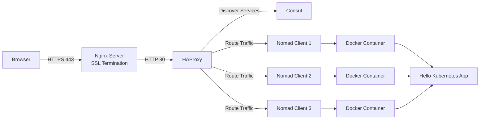

# Nomad + Consul + HAProxy + Nginx SSL Reverse Proxy Setup

## Project Overview

This project demonstrates a complete application deployment stack using HashiCorp Nomad, Consul, HAProxy, Docker, and Nginx with HTTPS termination.

The objective is to deploy a containerized application on a Nomad cluster, register services in Consul, dynamically route traffic through HAProxy, and securely expose the application through Nginx using SSL/TLS.

---
# End-to-End Traffic Flow



---

# Infrastructure Details

| Server | Purpose               |
| ------ | --------------------- |
| EC2-1  | Nginx Reverse Proxy   |
| EC2-2  | HAProxy Load Balancer |
| EC2-3  | Nomad + Consul Server |
| EC2-4  | Nomad + Consul Server |
| EC2-5  | Nomad + Consul Server |

---

# Components Used

* Ubuntu 24.04 LTS
* Docker
* HashiCorp Nomad
* HashiCorp Consul
* HAProxy
* Nginx
* OpenSSL
* Self-Signed SSL Certificate

---

# Prerequisites

* AWS EC2 instances
* Security Groups configured
* SSH access
* Internet access from instances

Required Ports:

| Port      | Purpose              |
| --------- | -------------------- |
| 22        | SSH                  |
| 80        | HTTP                 |
| 443       | HTTPS                |
| 4646      | Nomad UI/API         |
| 4647      | Nomad RPC            |
| 4648      | Nomad Serf           |
| 8500      | Consul UI/API        |
| 8300-8302 | Consul Communication |

---

# Step 1: Install Docker

```bash
sudo apt update
sudo apt install docker.io -y
```

Enable Docker:

```bash
sudo systemctl enable docker
sudo systemctl start docker
```

Verify:

```bash
docker ps
```

---

# Step 2: Install Consul

Download Consul:

```bash
wget https://releases.hashicorp.com/consul/<VERSION>/consul_<VERSION>_linux_amd64.zip
```

Extract:

```bash
sudo unzip consul*.zip -d /usr/local/bin/
```

Verify:

```bash
consul version
```

---

# Step 3: Configure Consul

Create configuration:

```hcl
datacenter = "dc1"
data_dir = "/opt/consul"
server = true
bootstrap_expect = 3
ui_config {
  enabled = true
}
```

Start Consul:

```bash
sudo systemctl enable consul
sudo systemctl start consul
```

Verify:

```bash
consul members
```

---

# Step 4: Enable Consul ACL

Update configuration:

```hcl
acl {
  enabled = true
  default_policy = "deny"
  enable_token_persistence = true
}
```

Restart:

```bash
sudo systemctl restart consul
```

Bootstrap ACL:

```bash
consul acl bootstrap
```

Save SecretID.

Export token:

```bash
export CONSUL_HTTP_TOKEN=<SECRET_ID>
```

Verify:

```bash
consul members
```

---

# Step 5: Install Nomad

Download Nomad:

```bash
wget https://releases.hashicorp.com/nomad/<VERSION>/nomad_<VERSION>_linux_amd64.zip
```

Extract:

```bash
sudo unzip nomad*.zip -d /usr/local/bin/
```

Verify:

```bash
nomad version
```

---

# Step 6: Configure Nomad Cluster

Server Configuration:

```hcl
datacenter = "dc1"
data_dir = "/opt/nomad"

server {
  enabled = true
  bootstrap_expect = 3
}
```

Client Configuration:

```hcl
client {
  enabled = true
}
```

Start Nomad:

```bash
sudo systemctl enable nomad
sudo systemctl start nomad
```

Verify:

```bash
nomad server members
```

---

# Step 7: Enable Nomad ACL

Configuration:

```hcl
acl {
  enabled = true
}
```

Restart:

```bash
sudo systemctl restart nomad
```

Bootstrap ACL:

```bash
nomad acl bootstrap
```

Export token:

```bash
export NOMAD_TOKEN=<SECRET_ID>
```

Verify:

```bash
nomad status
```

---

# Step 8: Deploy Sample Application

Create job file:

```hcl
job "frontend-ui" {

  datacenters = ["dc1"]
  type = "service"

  group "frontend" {

    network {
      port "http" {
        to = 8080
      }
    }

    task "frontend-ui" {

      driver = "docker"

      config {
        image = "paulbouwer/hello-kubernetes:1.10"
        ports = ["http"]
      }

      env {
        MESSAGE = "Welcome to your Nomad Application Mesh!"
      }

      service {
        name = "sample-app"
        port = "http"

        check {
          type     = "http"
          path     = "/"
          interval = "10s"
          timeout  = "2s"
        }
      }

      resources {
        cpu    = 150
        memory = 128
      }
    }
  }
}
```

Deploy:

```bash
nomad job run webapp.nomad
```

Verify:

```bash
nomad status
```

---

# Step 9: Configure Consul Service Discovery

Verify service registration:

```bash
consul catalog services
```

Expected:

```text
sample-app
```

Verify service instances:

```bash
consul catalog nodes -service sample-app
```

---

# Step 10: Configure HAProxy

Install:

```bash
sudo apt install haproxy -y
```

Configure frontend:

```haproxy
frontend http_front
    bind *:80
    default_backend sample_app
```

Configure backend:

```haproxy
backend sample_app
    balance roundrobin

    server-template sample 10 _sample-app._tcp.service.consul resolvers consul resolve-prefer ipv4 check
```

Restart:

```bash
sudo systemctl restart haproxy
```

Verify:

```bash
curl http://localhost
```

---

# Step 11: Install Nginx

Install:

```bash
sudo apt install nginx -y
```

Verify:

```bash
nginx -v
```

---

# Step 12: Generate Self-Signed SSL Certificate

Generate certificate:

```bash
sudo openssl req -x509 -nodes -days 365 \
-newkey rsa:2048 \
-keyout /etc/ssl/private/sampleapplication.key \
-out /etc/ssl/certs/sampleapplication.crt
```

Verify:

```bash
sudo ls -l /etc/ssl/private/sampleapplication.key
sudo ls -l /etc/ssl/certs/sampleapplication.crt
```

---

# Step 13: Configure Nginx HTTPS Reverse Proxy

HTTP Redirect:

```nginx
server {
    listen 80;
    server_name sampleapplication.com;

    return 301 https://$host$request_uri;
}
```

HTTPS Configuration:

```nginx
server {

    listen 443 ssl;

    server_name sampleapplication.com;

    ssl_certificate /etc/ssl/certs/sampleapplication.crt;
    ssl_certificate_key /etc/ssl/private/sampleapplication.key;

    ssl_protocols TLSv1.2 TLSv1.3;

    location / {

        proxy_pass http://172.31.7.199:80;

        proxy_set_header Host $host;
        proxy_set_header X-Real-IP $remote_addr;
        proxy_set_header X-Forwarded-For $proxy_add_x_forwarded_for;
        proxy_set_header X-Forwarded-Proto $scheme;
    }
}
```

Validate:

```bash
sudo nginx -t
```

Reload:

```bash
sudo systemctl reload nginx
```

---

# Step 14: Local Domain Mapping

Update local hosts file:

Linux:

```bash
sudo nano /etc/hosts
```

Add:

```text
65.0.110.181 sampleapplication.com
```

---

# Validation

Verify HTTPS:

```bash
curl -k https://sampleapplication.com
```

Verify SSL Listener:

```bash
sudo ss -tulpn | grep 443
```

Expected:

```text
LISTEN 0.0.0.0:443
```

---

# Final Result

Successfully deployed a containerized application using:

* Nomad for orchestration
* Consul for service discovery
* HAProxy for load balancing
* Nginx for reverse proxy
* SSL/TLS termination using self-signed certificates

Application accessible via:

```text
https://sampleapplication.com
```

---

# Future Enhancements

* Replace self-signed certificates with Let's Encrypt
* Configure Route53 DNS records
* Add Auto Scaling
* Integrate Vault for secrets management
* Enable Prometheus monitoring
* Add Grafana dashboards
* Configure CI/CD using Jenkins
* Multi-region deployment
* Zero-downtime deployments
* Service mesh integration

```
```
