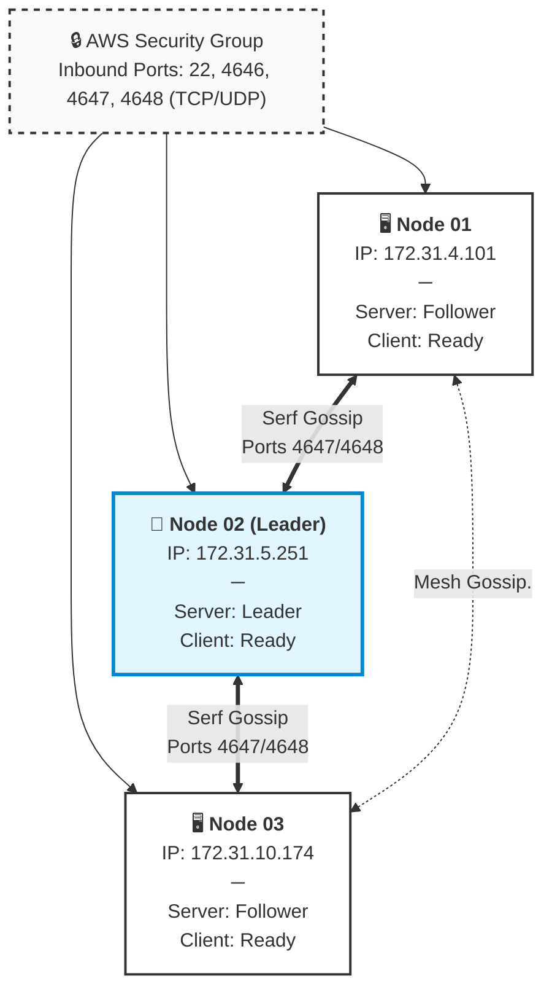

# Proof of Concept (PoC): 3-Node Nomad Cluster & Workload Orchestration

This repository contains the architecture documentation, configuration manifests, and verification runbooks utilized to establish a high-availability, 3-node HashiCorp Nomad cluster deployed on AWS EC2 infrastructure.

##  1. Cluster Architecture

The PoC implements a **3-Node Combined Cluster Topology**. Each instance pulls double-duty, running both the management plane and the workload execution plane simultaneously.

### Architectural Rationale vs. Alternative Topologies
* **Why not 1-Server / 2-Clients?** A 1-server deployment creates a catastrophic **Single Point of Failure (SPOF)**. If the single management node crashes, cluster orchestration freezes, telemetry ceases, and self-healing automation fails. 
* **The 3-Node Resilience Rule:** Nomad utilizes the Raft consensus protocol. By distributing server roles across all 3 nodes (`bootstrap_expect = 3`), the cluster achieves high-availability quorum. It can comfortably tolerate the complete loss of any single node without interrupting application delivery.

---


##  2. AWS Infrastructure & Network Prerequisites

### Compute Provisioning
* **Instance Type:** `t3.medium` (2 vCPUs, 4 GB RAM) - Chosen over `t3.micro` to provide memory headroom for OS processes, the Docker daemon, and Nomad tasks.
* **Operating System:** Ubuntu Server 24.04 LTS (HVM)
* **Storage Allocation:** 20 GB gp3 EBS Volume per instance

### Security Group Network Configuration
A shared AWS Security Group was applied to all three instances with the following inbound rule set:


| Type | Protocol | Port Range | Source | Description |
| :--- | :--- | :--- | :--- | :--- |
| **SSH** | TCP | `22` | `My IP` | Secure administrative terminal access |
| **Custom TCP** | TCP | `4646` | `My IP` / `This SG` | Nomad HTTP API access and Web UI |
| **Custom TCP** | TCP | `4647` | `This SG` | Internal Server-to-Client RPC pipeline |
| **Custom TCP** | TCP | `4648` | `This SG` | Raft & Serf WAN/LAN Gossip (TCP) |
| **Custom UDP** | UDP | `4648` | `This SG` | Serf WAN/LAN Discovery/Gossip (UDP) |

---

##  3. Installation & Core Configuration

### Step 1: Bootstrap System Dependencies (All Nodes)
Execute the following commands on all three instances to initialize the engine components:
```bash
# Update local packages and install Docker runtime engine
sudo apt-get update
sudo apt-get install -y docker.io
sudo systemctl start docker && sudo systemctl enable docker

# Trust and register the official HashiCorp GPG key and repository
sudo apt-get install -y gpg coreutils curl
curl -fSsL https://hashicorp.com | sudo gpg --dearmor -o /usr/share/keyrings/hashicorp-archive-keyring.gpg
echo "deb [signed-by=/usr/share/keyrings/hashicorp-archive-keyring.gpg] https://hashicorp.com $(lsb_release -cs) main" | sudo tee /etc/apt/sources.list.d/hashicorp.list

# Install Nomad v2.0.2 package
sudo apt-get update && sudo apt-get install -y nomad
```

### Step 2: Configure `/etc/nomad.d/nomad.hcl`
Inject the following baseline configuration block into your system configuration path. Ensure you append the exact local address to the `advertise` parameters on its respective node:

```hcl
data_dir  = "/opt/nomad/data"
bind_addr = "0.0.0.0"

# Explicit network interface binding instruction for AWS topologies
advertise {
  http = "YOUR_NODE_PRIVATE_IP"
  rpc  = "YOUR_NODE_PRIVATE_IP"
  serf = "YOUR_NODE_PRIVATE_IP"
}

server {
  enabled          = true
  bootstrap_expect = 3
}

client {
  enabled = true
}

retry_join = ["172.31.10.174", "172.31.5.251", "172.31.4.101"]
```

---

##  4. Cluster State Verification

Verify cluster integrity by reviewing the outputs of the management, runtime, and database planes:

### 1. Evaluate Server Cluster Members
```bash
nomad server members
```
```text
Name                     Address        Port  Status  Leader  Raft Version  Build  Datacenter  Region
ip-172-31-10-174.global  172.31.10.174  4648  alive   false   3             2.0.2  dc1         global
ip-172-31-4-101.global   172.31.4.101   4648  alive   false   3             2.0.2  dc1         global
ip-172-31-5-251.global   172.31.5.251   4648  alive   true    3             2.0.2  dc1         global
```

### 2. Evaluate Worker Node Capacities
```bash
nomad node status
```
```text
ID        Node Pool  DC   Name              Class   Drain  Eligibility  Status
e59d1f9f  default    dc1  ip-172-31-4-101   <none>  false  eligible     ready
11e8aa34  default    dc1  ip-172-31-10-174  <none>  false  eligible     ready
5eb7c301  default    dc1  ip-172-31-5-251   <none>  false  eligible     ready
```

### 3. Evaluate Raft Consistency Layer
```bash
nomad operator raft list-peers
```
```text
Node                     ID                                    Address             State     Voter  RaftProtocol
ip-172-31-10-174.global  b7a69bfd-a93e-bc21-bea6-658ec14def9b  172.31.10.174:4647  follower  true   3
ip-172-31-4-101.global   db6db6fd-6f66-83cc-a47a-cc359fe534c2  172.31.4.101:4647   follower  true   3
ip-172-31-5-251.global   4da7f028-8956-5aa9-5324-006ccb4bd019  172.31.5.251:4647   leader    true   3
```

---

##  5. Sample Job Lifecycle & Deployment

The deployment maps to Nomad’s core orchestration hierarchy: **Job** ➔ **Task Group** ➔ **Task**.

### 1. Job Specification (`nginx.nomad`)
```hcl
job "my-job1" {
  datacenters = ["dc1"]
  type        = "service"
  group "group-job1" {
    count = 1

    network {
      port "http" {
        to = 80
      }
    }

    task "job1-nginx-task" {
      driver = "docker"

      config {
        image = "nginx:alpine"
        ports = ["http"]
      }

      resources {
        cpu    = 200
        memory = 128
      }
    }
  }
}
```

### 2. Execution Runbook
```bash
# Dry-run analysis step to inspect matching node capacity
nomad job plan nginx.nomad

# Submit and initialize the workload payload to the cluster leader
nomad job run -check-index 0 nginx.nomad

# Review live execution telemetry and tracking states
nomad job status my-job1
```

### 3. Active Allocation Profile
```text
Status        = running
Latest Deployment Status = successful

Allocations
ID        Node ID   Task Group  Version  Desired  Status   Created  Modified
caa98fb0  11e8aa34  group-job1  0        run      running  56s ago  40s ago
```
The active container allocation `caa98fb0` was automatically targeted, matched, and deployed by Nomad's server brain onto worker Node ID `11e8aa34` (`172.31.10.174`).

---

##  6. Clean-Up Operations
When the validation window closes, teardown the application workload to free cluster hardware allocations:
```bash
# Gracefully stop and completely purge the deployment tracking reference from state
nomad job stop -purge my-job1
```
